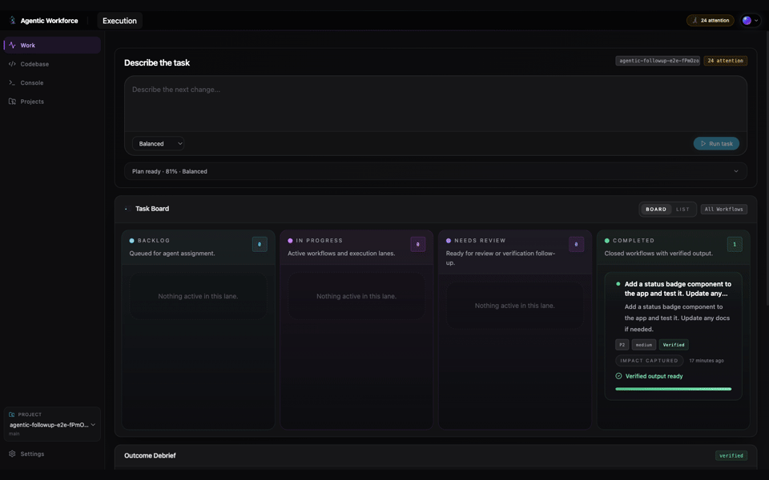
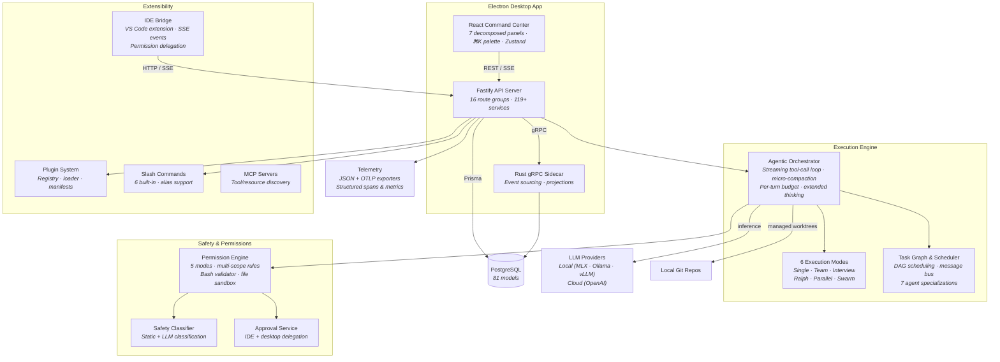

# Agentic Workforce

<p align="center">
  
</p>

<p align="center">
  <a href="https://github.com/obelaiquality/agentic_workforce/actions/workflows/ci.yml"></a>
  <a href="https://codecov.io/gh/obelaiquality/agentic_workforce"></a>
  <a href="https://github.com/obelaiquality/agentic_workforce/releases"></a>
  <a href="LICENSE"></a>
  <a href="docs/install.md"></a>
  <a href="docs/testing.md"></a>
  <a href="docs/testing.md"></a>
  <a href="docs/testing.md"></a>
  <a href="docs/testing.md"></a>
</p>

<p align="center">
  A next-generation local-first coding agent with multi-mode execution, plugin architecture, IDE integration, and advanced multi-agent orchestration.<br>
  Connect a repo, scope a task, execute in a managed worktree, verify the result. Your code never leaves your machine unless you choose to.
</p>

<p align="center">
  
</p>

---

## Quick Start with OpenAI (Recommended)

The fastest way to get running. You just need Node.js, PostgreSQL, and an OpenAI API key.

```bash
git clone https://github.com/obelaiquality/agentic_workforce.git
cd agentic_workforce
npm install
cp .env.example .env
```

Open `.env` and add your key:

```env
OPENAI_API_KEY=sk-your-key-here
```

Then start everything:

```bash
npm run db:up              # Start PostgreSQL (Docker) — or use your own Postgres
npx prisma db push         # Create database tables
npx prisma generate        # Generate Prisma client
npm run dev:desktop        # Launch the app
```

That's it. The app opens, and you're ready to connect a repo and run your first task.

> **Don't have Docker?** Just point `DATABASE_URL` in `.env` to any running PostgreSQL instance. See [Install guide](docs/install.md) for details.

### Your First Task

1. Open **Projects** > **Connect New** > create a new project or connect a local repo
2. Switch to **My Projects** and click **Apply Starter** to scaffold a TypeScript app
3. Go to **Work**, write a bounded task, and click **Run task**
4. Inspect the result in **Codebase** and **Console**

Try these prompts to start:

- `Add a status badge component with tests`
- `Rename the hero headline and update the test`
- `Add a dark mode toggle with localStorage persistence`

---

## Quick Start with Local Models (No Cloud)

For users who want everything running locally with no API keys and no cloud calls. Your code and prompts stay entirely on your machine.

### macOS (Apple Silicon)

```bash
# Install the model server
pip3 install mlx-lm

# Download and start the model (one-time ~2.5 GB download)
python3 -m mlx_lm.server \
  --model mlx-community/Qwen3.5-4B-4bit \
  --host 127.0.0.1 --port 8000
```

### macOS (Intel) / Linux / Windows

```bash
# Install Ollama from https://ollama.com
ollama pull qwen2.5-coder:3b
ollama serve    # Starts on port 11434 by default
```

Then set up the app (same as OpenAI path, minus the API key):

```bash
git clone https://github.com/obelaiquality/agentic_workforce.git
cd agentic_workforce
npm install
cp .env.example .env
```

Open `.env` and configure for local models:

```env
# For MLX-LM (Apple Silicon):
INFERENCE_PROVIDER=openai-compatible
LOCAL_INFERENCE_URL=http://127.0.0.1:8000/v1

# For Ollama:
INFERENCE_PROVIDER=ollama-openai
LOCAL_INFERENCE_URL=http://127.0.0.1:11434/v1
```

```bash
npm run db:up
npx prisma db push
npx prisma generate
npm run dev:desktop
```

> **GPU users:** vLLM and SGLang are supported for NVIDIA GPUs with better throughput. See [Configuration](docs/configuration.md) for setup.

---

## Choose Your Path

| Path | Best for | What you need |
| --- | --- | --- |
| **OpenAI** | Fastest setup, strongest models | Node 20+, PostgreSQL, `OPENAI_API_KEY` |
| **Local models** | Full privacy, no cloud calls | Node 20+, PostgreSQL, MLX-LM / Ollama / vLLM |
| **Binary** | Shortest install, no source checkout | A signed [GitHub Release](https://github.com/obelaiquality/agentic_workforce/releases) |
| **Hybrid** | Best of both — local for fast tasks, OpenAI for complex ones | All of the above |

More detail: [Install](docs/install.md) · [Support matrix](docs/support-matrix.md) · [Configuration](docs/configuration.md) · [Known limitations](docs/known-limitations.md)

---

## Architecture Overview



**Key data flows:**
- **Execution pipeline** — objective → route → context → agentic loop (with micro-compaction + per-turn budgets) → verification → report
- **Multi-agent orchestration** — coordinator → task graph (DAG) → scheduler → parallel agents with message bus → conflict resolution
- **Self-learning** — execution insights → learnings → 24h dream cycle → consolidated principles → suggested skills
- **Cross-project knowledge** — high-confidence learnings promoted to global pool → tech-fingerprint matched → injected into future runs across all projects
- **Approval gating** — tool calls → permission engine (5 modes) → safety classifier → user/IDE approval → audit log
- **Plugin pipeline** — manifest discovery → Zod validation → tool/command/hook registration → runtime integration

Full architecture with C4 diagrams: [docs/architecture.md](docs/architecture.md)

---

## What Works Today

### Core Platform
- **Desktop app** with decomposed Command Center (ChatPanel, WorkflowBoard, ToolCallTimeline, ApprovalInline, DiffViewer, AgentStatusSidebar), Codebase browser, Console event stream, and Settings
- **Managed-worktree execution** against real local repos with shadow git snapshots and per-step rollback
- **6 execution modes** — single agent, multi-agent team, interview (ambiguity crystallization), Ralph (phase-based verification), centralized parallel, and research swarm
- **New project bootstrap** from an empty folder with TypeScript App starter
- **Route review, execution, approvals, verification**, and report generation

### Query Engine
- **Streaming tool-call loop** with micro-compaction of large tool results before context entry
- **Per-turn token budget enforcement** with pre-call estimation and automatic compaction triggers
- **Extended thinking mode** (off/on/auto) — auto-activates on first iteration and after model escalation
- **Format error fallback** — tracks consecutive tool errors and falls back to simpler models after 3 failures
- **8-level edit matcher chain** — exact match through probabilistic best-effort for reliable code edits
- **Doom loop detection** — MD5 fingerprint sliding window prevents stuck agent patterns

### Plugin & Command System
- **Plugin architecture** — `PluginRegistry` + `PluginLoader` with Zod-validated manifests, supports tools, commands, hooks, and system prompt contributions
- **Slash commands** — `/commit`, `/debug`, `/plan`, `/verify`, `/status`, `/help` with alias support and extensible registry
- **Custom agent definitions** — `.agentic-workforce/agents.json` for project-specific agent configurations
- **MCP server integration** — Model Context Protocol support for external tool and resource discovery

### IDE Integration
- **VS Code extension** (`extensions/vscode/`) — connect, disconnect, and panel commands with status bar provider
- **IDE bridge server** — 5 HTTP/SSE endpoints for session management, event streaming, and approval delegation
- **Permission delegation** — approval requests can be routed to the IDE instead of the desktop UI with configurable timeouts

### Permission & Safety System
- **5 permission modes** — default (policy-based), plan (read-only allowed), bypass (trusted environments), acceptEdits (file ops auto-approved), auto (ML classifier)
- **Multi-scope rule resolution** — session > project > user priority with cached policy sets
- **Bash command validator** — tokenizes commands on pipes/semicolons/`&&`/`||`, validates each segment against 16 dangerous patterns
- **File sandbox** — path normalization with allowed root directories and blocked patterns (`.env`, `.pem`, `.key`, `id_rsa`)
- **Safety classifier** — static pattern matching + LLM-based classification with result caching

### Advanced Orchestration
- **Task dependency graph** — DAG with cycle detection, topological sort (Kahn's algorithm), and cascading readiness promotion
- **Task scheduler** — concurrent batch scheduling with configurable parallelism limits and progress tracking
- **Inter-agent message bus** — typed channels (FileUpdate, DiscoveryResult, BlockageReport, ReviewRequest), priority queuing, broadcast/subscribe with 100-message FIFO eviction
- **7 agent specializations** — planner, implementer, tester, reviewer, debugger, refactorer, documenter — each with tailored system prompts, tool subsets, and model roles

### Observability
- **Structured telemetry** — spans and metrics with run/agent/tool/provider attributes
- **JSON file exporter** — local-first telemetry persistence with automatic cleanup
- **OTLP exporter** — optional OpenTelemetry Protocol export via native fetch (no SDK dependency)
- **Dynamic system prompt builder** — priority-based section assembly with per-section token budgets and cache-first ordering for prompt caching
- **Token estimator** — tiktoken integration with automatic fallback to heuristic estimation
- **Health check endpoint** — `GET /api/telemetry/health` with uptime, memory, and timestamp

### Model Providers
- **Local model runtime** with MLX-LM (Apple Silicon), Ollama (cross-platform), vLLM, SGLang, llama.cpp, or TensorRT-LLM
- **OpenAI escalation** for complex tasks with configurable model roles and budget controls
- **4 model roles** — `utility_fast` (quick tasks), `coder_default` (implementation), `review_deep` (analysis), `overseer_escalation` (complex decisions)
- **Provider orchestrator** with full fallback chain, retry with backoff, and connection recovery

### Self-Learning
- **Episodic memory** with temporal decay and cosine similarity retrieval
- **Auto-extraction** of learnings from successful execution runs
- **Dream scheduler** — 24h background cycle for learning consolidation and skill synthesis
- **Global knowledge pool** — cross-project learning aggregation with tech-fingerprint matching
- **Training pipeline** — automated dataset generation from successful execution runs

---

## Testing

```bash
npx vitest run                            # 3542 unit/integration tests
npm run validate                          # Tests + lint + typecheck + builds
npm run test:e2e:desktop-acceptance       # Full desktop acceptance (UI + execution)
npm run test:e2e:desktop-stable           # Stable desktop E2E subset
npm run test:e2e:followup:status-badge    # Follow-up scenario: component creation
npm run test:e2e:followup:progress-bar    # Follow-up scenario: progress widget
npm run test:e2e:followup:utility-module  # Follow-up scenario: backend function
npm run test:e2e:followup:api-stop        # Follow-up scenario: execution stop
npm run test:e2e:followup:rename-component # Follow-up scenario: refactoring
npm run test:e2e:failure-injection        # Failure injection: API errors, stream disconnect, error boundary
npm run test:e2e:nightly                  # Broader regression coverage
npm run demo:capture && npm run demo:render  # Regenerate README GIF
```

### Test Coverage by Area

| Area | Test files | Tests | Key coverage |
| --- | --- | --- | --- |
| Server services | 95+ | ~1800 | Execution, context, memory, providers, tools |
| Server routes | 16 | ~200 | All API endpoints with error cases |
| Execution engine | 20+ | ~350 | Orchestrator, coordinator, Ralph, interview, team modes |
| Permissions | 6 | 243 | 5 modes, bash validator, file sandbox, scope resolution |
| Plugins & commands | 5 | 67 | Registry, loader, slash commands, agent definitions |
| IDE bridge | 3 | 45 | Session management, approval delegation, event streaming |
| Telemetry & observability | 4 | 53 | JSON/OTLP exporters, system prompt builder, token estimator |
| Advanced orchestration | 3 | 84 | Task graph (DAG), scheduler, message bus |
| Frontend components | 40+ | ~400 | Views, interview/ralph/team panels, hooks, error boundaries |
| Error path integration | 3 | 42 | Doom loop recovery, budget exhaustion, compaction cascade, provider fallback |
| E2E (Playwright) | 28 scripts | - | Desktop acceptance, follow-up scenarios, failure injection, nightly |

### Platform Status

| Platform | Unit tests | Desktop E2E | Status |
| --- | --- | --- | --- |
| macOS (Apple Silicon) | 3542/3542 | Full pass (local + OpenAI) | Primary platform |
| Ubuntu/Debian | CI pass | CI pass (xvfb) | CI-validated |
| macOS (Intel) | Expected pass | Not yet verified | **Help wanted** |
| Windows | Expected pass | Not yet verified | **Help wanted** |
| Other Linux | Expected pass | Not yet verified | **Help wanted** |

Full testing documentation: [docs/testing.md](docs/testing.md)

---

## Project Structure

```
src/
  server/
    execution/        # Orchestrator, coordinator, task graph, scheduler, message bus, modes
    permissions/       # Policy engine (5 modes), bash validator, file sandbox, scope resolver
    plugins/           # Plugin registry, loader, agent definition loader
    commands/          # Slash command registry, 6 built-in commands
    ide/               # IDE bridge server, session manager, permission delegate
    telemetry/         # Tracer, metrics, JSON/OTLP exporters
    providers/         # Provider factory, orchestrator, 4 adapters
    services/          # 119+ services (context, memory, tools, learning, etc.)
    routes/            # 16 route groups for the Fastify API
    tools/             # 40+ tool definitions with registry and deferred loading
    hooks/             # Lifecycle hook service
    skills/            # Skill service with built-in skill definitions
    memory/            # Auto-extractor, episodic/working memory
    lsp/               # Language server protocol client
    mcp/               # Model Context Protocol client and registry
    plans/             # Plan-first execution mode
  app/
    components/
      command-center/  # Decomposed Command Center (7 panels + composition root)
      views/           # 13 full-page views
      interview/       # Interview mode UI (5 components)
      ralph/           # Ralph mode UI (5 components)
      team/            # Team mode UI (5 components)
      ui/              # 46 Radix-based primitive components
    hooks/             # React hooks (mission control, keyboard, interview/ralph/team modes)
    lib/               # API client, desktop bridge, utilities
    store/             # Zustand UI store
  shared/
    contracts.ts       # Domain types shared between server and client
extensions/
  vscode/              # VS Code extension (connect, disconnect, panel, status bar)
scripts/
  playwright/          # 28 E2E test scripts
electron/              # Electron main process (main.mjs, preload.mjs)
prisma/
  schema.prisma        # 81 models
```

---

## Contributing

We welcome contributions of all kinds. Some areas where help is especially valuable:

- **Windows and Linux testing** — Run `npm run validate` and `npm run test:e2e:desktop-stable` on your platform and report results. Even a "it passed on Windows 11" is helpful.
- **Plugin development** — Create plugins with custom tools, commands, or skills. See the plugin manifest format in `src/server/plugins/pluginTypes.ts`.
- **VS Code extension** — The extension scaffold in `extensions/vscode/` is ready for feature development (WebView panels, inline diffs, diagnostic integration).
- **Local runtime backends** — Test with Ollama, vLLM, SGLang, or llama.cpp on different hardware configurations.
- **Bug reports** — File issues with OS, install path, and logs attached.
- **Documentation** — Improve guides for platforms and runtimes you use.
- **Code contributions** — See [CONTRIBUTING.md](CONTRIBUTING.md) for ground rules.

### Local Setup for Contributors

```bash
git clone https://github.com/obelaiquality/agentic_workforce.git
cd agentic_workforce
npm install
cp .env.example .env
npm run doctor          # Check prerequisites
npm run db:up           # Start PostgreSQL
npx prisma db push && npx prisma generate
npm run dev:desktop     # Launch the app
```

Run `npm run validate` before submitting a PR. See [CONTRIBUTING.md](CONTRIBUTING.md) for the full checklist.

## Specialized Workflows

- **Browser preview**: useful for inspection and light settings work, not full operator parity
- **Fully local runtime**: supported with MLX-LM (macOS), Ollama (cross-platform), vLLM/SGLang (NVIDIA), llama.cpp (portable)
- **Benchmarks, Labs, training workflows, and channels**: supported as specialized workflows with dedicated runbooks
- **Packaged desktop releases**: ship through GitHub Releases with per-platform notes, signatures, and checksums
- **IDE bridge**: connect VS Code (or other editors) to the running desktop app for inline approvals and event streaming

Read this before filing a bug about missing functionality: [Known limitations](docs/known-limitations.md)

## Documentation

| Guide | Description |
| --- | --- |
| [Install](docs/install.md) | Three install paths (binary, source + OpenAI, source + local) |
| [Onboarding](docs/onboarding.md) | First 30 minutes walkthrough |
| [Configuration](docs/configuration.md) | Environment variables and runtime settings |
| [Testing](docs/testing.md) | Test tiers, E2E coverage, platform matrix |
| [Architecture](docs/architecture.md) | System design and component overview |
| [CLI](docs/cli.md) | CLI companion for headless workflows |
| [Demo](docs/demo.md) | Demo assets and media pipeline |
| [FAQ](docs/faq.md) | Common questions |
| [Troubleshooting](docs/troubleshooting.md) | Common issues and fixes |
| [Support matrix](docs/support-matrix.md) | Surface-by-surface support commitments |
| [Release checklist](docs/release-checklist.md) | Release process |
| [SBOM](docs/sbom.production.cdx.json) | Production software bill of materials |

## Community

- Usage questions and setup issues: [SUPPORT.md](SUPPORT.md)
- Vulnerability reporting: [SECURITY.md](SECURITY.md)
- Contributing guide: [CONTRIBUTING.md](CONTRIBUTING.md)
- Roadmap: [ROADMAP.md](ROADMAP.md)
- Maintainers: [MAINTAINERS.md](MAINTAINERS.md)
- Changelog: [CHANGELOG.md](CHANGELOG.md)
- Code of conduct: [CODE_OF_CONDUCT.md](CODE_OF_CONDUCT.md)

## Security

- **Desktop API auth** — header-only with `x-local-api-token`. No query-string tokens.
- **IDE bridge auth** — per-session JWT-style tokens via `crypto.randomBytes(32)`. Localhost-only binding (`127.0.0.1`). All endpoints validate the session token.
- **Provider keys** — handled as write-only settings and stored outside normal settings JSON.
- **Permission engine** — 5 modes with multi-scope rule resolution. Bash commands tokenized and validated per-segment against dangerous patterns. File writes sandboxed to allowed root directories.
- **File sandbox** — blocks writes to sensitive files (`.env`, `.pem`, `.key`, `id_rsa`) and paths outside the managed worktree.
- **Standalone API** — `npm run dev:api` requires a non-empty `API_TOKEN`.
- **Browser preview** — requires a matching `VITE_API_TOKEN`.
- **Channel integrations and autonomy surfaces** — opt-in, not part of the default launch path.

Report vulnerabilities through [SECURITY.md](SECURITY.md).

## License

[MIT](LICENSE)
