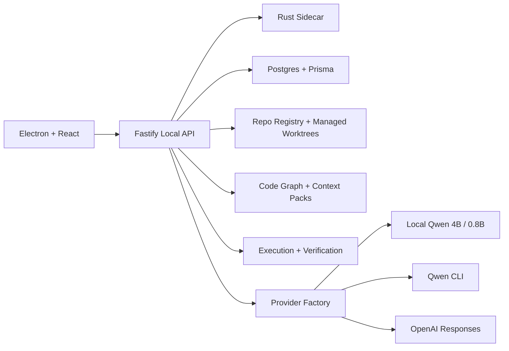
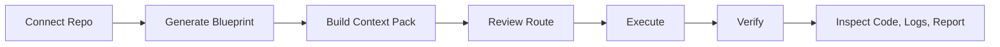

# Agentic Workforce

Desktop-first local coding agent for real repos.

It is built around a simple operator flow:

1. Connect a repo or create a new project
2. Confirm the project blueprint
3. Ask the Overseer for a coding task
4. Review the route
5. Execute
6. Verify with real lint, test, and build output
7. Inspect the code, logs, and report

The system already has real backend plumbing behind that flow:
- local Qwen `4B` for build/review work
- local Qwen `0.8B` for fast targeting/context support
- optional `OpenAI Responses` escalation
- optional `Qwen CLI` provider with multi-account failover
- managed worktrees
- project blueprints
- code graph and context packs
- execution attempts, verification bundles, and shareable reports

## What Is Actually Working Today

These paths are real and usable now:
- Electron desktop app startup
- local repo connect from the native folder picker
- empty-folder bootstrap into a new TypeScript app
- project blueprint generation and persistence
- real `Codebase` file tree and file content viewer
- real `Console` event stream
- route review and execute flow in the Overseer drawer
- local `Qwen 3.5 4B` scaffold generation
- local `Qwen 3.5 4B` follow-up feature-edit path for the validated `StatusBadge` component scenario
- real verification runs:
  - `lint`
  - `test`
  - `build`
- shareable run reports

These paths exist but are still being hardened:
- broader arbitrary multi-file follow-up feature edits on the local `4B` model
- polished GitHub App repo connect flow
- deeper Labs surfaces and benchmark tooling for non-core users

That means you should treat the current product as:
- reliable for scaffold + bounded repo tasks
- proven on the explicit `StatusBadge` follow-up component scenario
- actively improving for broader arbitrary multi-file follow-up edits

## Desktop First

The real product path is the Electron desktop app.

The raw browser preview at `http://127.0.0.1:5173` is useful for visual debugging, but it does **not** support the native repo picker.

Use the desktop app for normal operation.

## Prerequisites

- Node.js `20+`
- Python `3.11+`
- Docker Desktop or compatible local Docker runtime
- Rust toolchain
- macOS Apple Silicon is the smoothest current path

## Quick Start

### 1. Install dependencies

```bash
npm install
```

### 2. Start Postgres and local services

```bash
npm run db:up
```

### 3. Start the local Qwen 4B runtime

In a separate terminal:

```bash
python3 -m pip install --upgrade mlx-lm
python3 -m mlx_lm.server --model mlx-community/Qwen3.5-4B-4bit --host 127.0.0.1 --port 8000 --temp 0.15 --max-tokens 1600
```

Optional health check:

```bash
curl http://127.0.0.1:8000/health
```

### 4. Start the desktop app

From [/Users/neilslab/agentic_workforce](/Users/neilslab/agentic_workforce):

```bash
npm run start:desktop
```

If the backend and frontend are already running and you only want the Electron shell:

```bash
npm run dev:desktop
```

## First Run

### Fastest confidence path

1. Launch the desktop app
2. Click `New Project` or `Choose Local Repo`
3. Pick an empty folder
4. Choose the default template: `TypeScript App`
5. Let the app:
   - initialize Git if needed
   - create the managed worktree
   - generate a project blueprint
   - scaffold the app
   - run verification
6. Open:
   - `Codebase` to inspect real generated files
   - `Console` to inspect real execution and verification events
   - `Runs` to inspect the verification bundle and report

## Recommended First Tasks

Start with bounded tasks.

Good first tasks:
- `Scaffold a TypeScript app with tests and documentation`
- `Change the hero headline and update the test`
- `Add one button and verify lint, tests, and build`
- `Update the README wording to match the UI`

The current proven follow-up acceptance task is:
- `Add a status badge component and test it. Update docs if needed.`

That path now completes end to end with:
- a real component file
- test updates
- README update
- green `lint`
- green `test`
- green `build`

Broader arbitrary multi-file follow-up edits are still being hardened.

## Runtime Model

The normal user-facing mode names are:

- `Fast`
- `Build`
- `Review`
- `Escalate`

Current role mapping:

- `Fast` -> local `Qwen/Qwen3.5-0.8B`
- `Build` -> local `mlx-community/Qwen3.5-4B-4bit`
- `Review` -> local `mlx-community/Qwen3.5-4B-4bit` with deeper reasoning
- `Escalate` -> `openai-responses`

The product is designed so users normally think in terms of modes, not raw provider ids.

## Optional Providers

### Qwen CLI multi-account failover

This remains available as an optional provider-level alternative.

Use it if you want Google-backed Qwen account rotation instead of local inference:

1. Open `Settings`
2. Enable the `Qwen CLI` provider
3. Use `Create + Auth` or `Import Current`
4. Add one profile per account

This path is real, but it is not the baseline happy path for onboarding or empty-repo scaffolding.

### OpenAI Responses escalation

You can enable escalation by putting your API key in [.env](/Users/neilslab/agentic_workforce/.env):

```bash
OPENAI_API_KEY=your_key_here
OPENAI_MODEL=gpt-5.4
```

`npm run start:desktop` loads `.env` automatically.

Use this as an escalation path, not as the default coding runtime.

## Product Surfaces

Normal product surfaces:
- `Landing`
- `Live State`
- `Codebase`
- `Console`
- `Projects`
- `Settings`

Internal or advanced systems are intentionally pushed out of the main path:
- benchmarks
- distillation
- demo packs
- deep runtime tuning
- developer diagnostics

Those belong in `Settings > Labs`, not the normal onboarding flow.

## Project Blueprint

Each connected project gets a `Project Blueprint`.

This is the operating contract for the repo:
- coding standards
- testing policy
- documentation policy
- execution guardrails
- provider policy

The app derives the initial blueprint from repo files such as:
- `AGENTS.md`
- `README*`
- `docs/**`
- `package.json`
- lint/test/build config
- CI config

The blueprint is then used to drive:
- context pack creation
- route planning
- execution
- verification command choice
- docs requirement checks
- run reports

## Architecture At A Glance



## Mental Model



## Most Useful Commands

```bash
npm run doctor
npm run db:up
npm run start:desktop
npm run dev:desktop
npm run build
npm run build:server
npm test
npm run test:e2e:desktop-acceptance
```

The desktop acceptance harness currently proves:
- empty-folder bootstrap into a TypeScript app
- scaffold verification
- real Codebase content loading
- real Console event loading
- follow-up `StatusBadge` component creation
- green `lint`, `test`, and `build`
- report generation

## Current Truth And Limitations

This is the honest state of the product:

- The desktop shell is the real supported path
- The native local repo picker works in Electron
- `Codebase` now shows real file contents from the managed worktree
- `Console` now shows real mission/provider/verification/indexing events
- Empty-folder scaffold works with the local `4B` runtime
- The local `4B` follow-up edit path is proven for the explicit `StatusBadge` component acceptance case
- The local `4B` path is still being hardened for broader arbitrary multi-file follow-up edits

Do not over-read the current product as a “fully autonomous developer for arbitrary repo work”. That is not a defensible claim yet.

It **is** a real local coding product for:
- repo onboarding
- scaffold generation
- bounded edits
- blueprint-aware verification
- report-driven review

## Troubleshooting

### The app opens in a browser tab but the repo picker does nothing

Use the Electron desktop app:

```bash
npm run start:desktop
```

The browser preview does not have the native desktop bridge.

### The app opens but the model does not answer

Check:

```bash
curl http://127.0.0.1:8000/health
```

Then confirm the On-Prem provider is pointed at:

- `http://127.0.0.1:8000/v1`

### The scaffold path fails

Check:
- model health
- Postgres is up
- `Console` for verification output
- `Runs` for the verification bundle and report

Then rerun from a clean empty folder.

### Qwen CLI is configured but not answering

Open `Settings` and confirm:
- the account is enabled
- auth is valid
- the provider is selected intentionally

Re-run auth or import the current `~/.qwen` session if needed.

## Docs

- [Onboarding](/Users/neilslab/agentic_workforce/docs/onboarding.md)
- [Architecture](/Users/neilslab/agentic_workforce/docs/architecture.md)
- [Troubleshooting](/Users/neilslab/agentic_workforce/docs/troubleshooting.md)
- [Local Runtime Runbook](/Users/neilslab/agentic_workforce/docs/runbooks/local-runtime.md)
- [Qwen CLI Accounts](/Users/neilslab/agentic_workforce/docs/runbooks/qwen-cli-accounts.md)
- [Playwright E2E](/Users/neilslab/agentic_workforce/docs/runbooks/playwright-e2e.md)
- [Distillation Runbook](/Users/neilslab/agentic_workforce/docs/runbooks/distillation-pilot.md)

## Packaging

- Source startup: `npm run start:desktop`
- Electron shell only: `npm run dev:desktop`
- Desktop build: `npm run dist:desktop`

## For Engineers Working On The Product

The main active engineering focus areas are:
- local `4B` follow-up edit reliability
- tighter blueprint-aware verification and reporting
- Electron acceptance harness hardening
- cleaner mission-control BFF unification
- carefully constrained parallelism only after single-agent reliability is green
