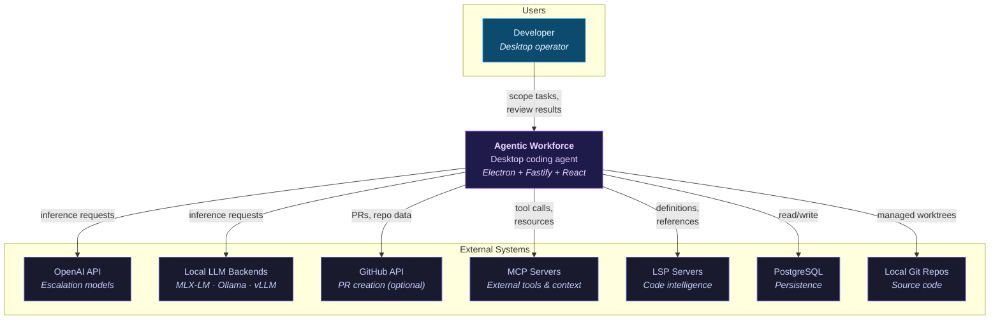
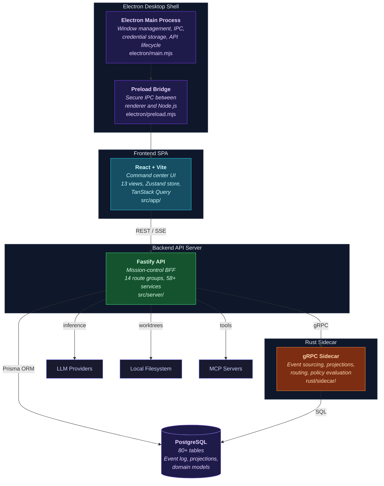
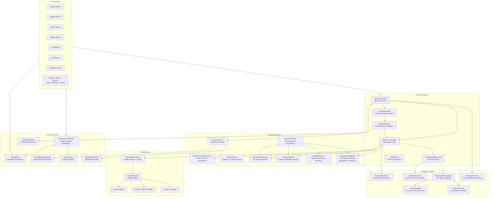
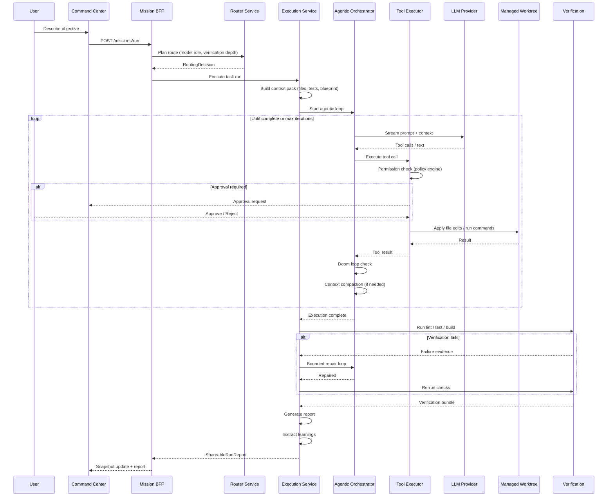
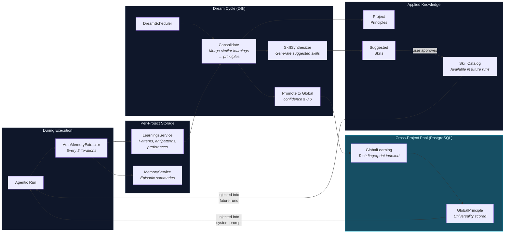
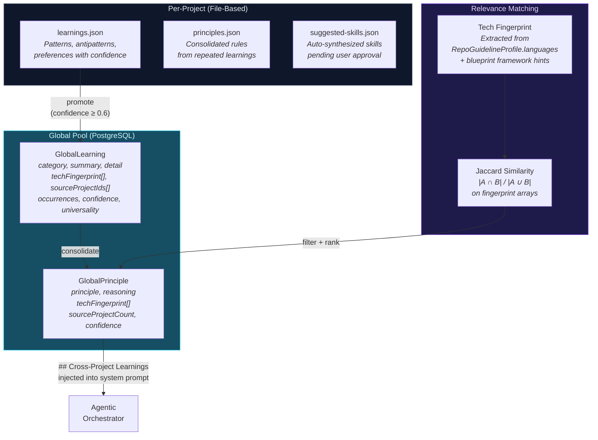
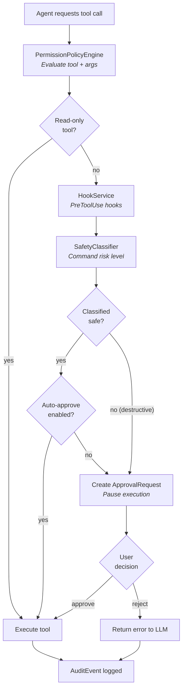
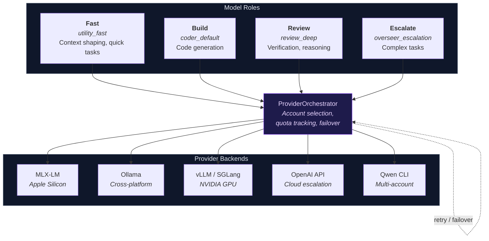
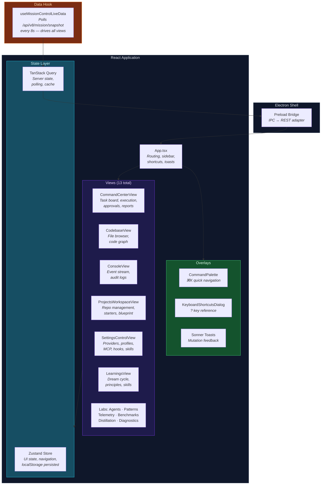
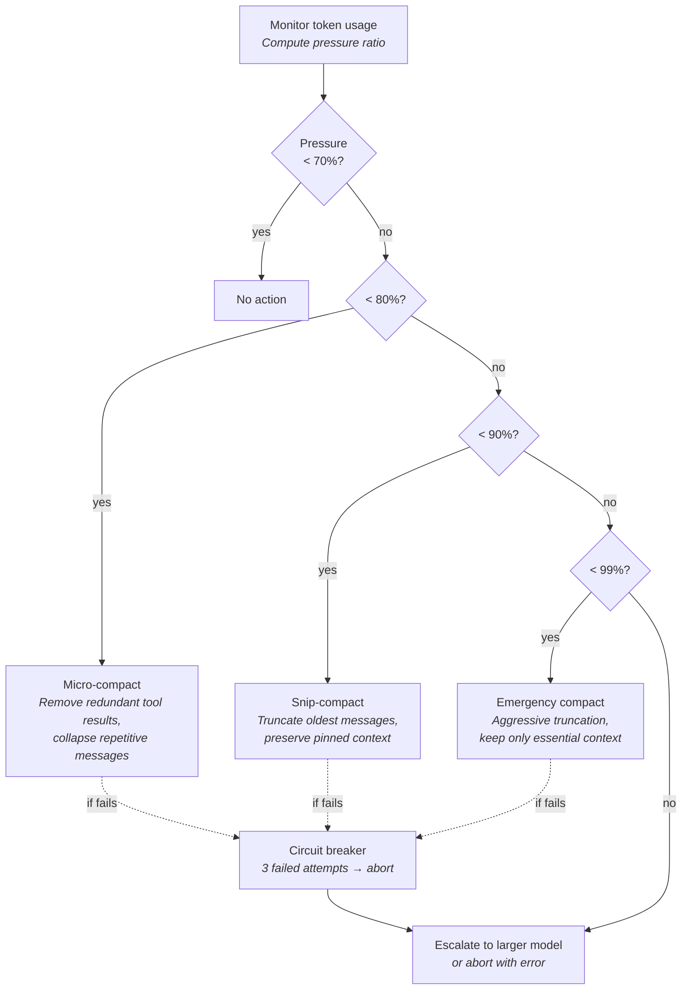

# Architecture

## Product Shape

The product is a desktop-first command center for coding work.

The normal operator flow is:
1. connect or create a project
2. confirm the project blueprint
3. issue an objective in `Work`
4. review the route
5. execute in a managed worktree
6. verify with real lint/test/build commands
7. inspect code, logs, approvals, comments, and the final report

The normal product surface is:
- `Work`
- `Codebase`
- `Console`
- `Projects`
- `Settings`

Labs and internal tooling still exist, but they are intentionally pushed out of the first-layer UX.

---

## C4 Model — System Context (Level 1)

Who uses the system and what external systems does it interact with.



---

## C4 Model — Container Diagram (Level 2)

The major runtime containers that compose the desktop application.



---

## C4 Model — Component Diagram (Level 3): Backend

The service layer inside the Fastify backend, organized by domain.



---

## Execution Pipeline

How a task flows from user input through execution to verified report.



---

## Self-Learning Pipeline

How the system learns from execution runs, synthesizes skills, and shares knowledge across projects.



---

## Cross-Project Knowledge System

How knowledge flows between projects to benefit the user across their entire workspace.

### Data Model



### How It Works

1. **During execution**, the `AutoMemoryExtractor` records learnings (patterns, antipatterns) every 5 iterations into per-project JSON files.

2. **During the dream cycle** (every 24 hours), the `DreamScheduler` iterates all projects:
   - Consolidates local learnings into per-project principles
   - Synthesizes skill suggestions from repeated patterns
   - **Promotes** learnings with `confidence ≥ 0.6` to the `GlobalLearning` table
   - Deduplicates via cosine similarity on summary text (threshold: 0.55)
   - Merges matching entries: increments occurrences, merges source project IDs, boosts confidence

3. **Global consolidation** runs after all projects are processed:
   - Groups related global learnings and synthesizes `GlobalPrinciple` records
   - Recomputes `universality` scores: `sourceProjectCount / totalProjectCount`

4. **At run start**, the `AgenticOrchestrator` fetches relevant global principles:
   - Extracts the current project's tech fingerprint from `RepoGuidelineProfile.languages`
   - Queries global principles filtered by Jaccard similarity on tech fingerprints
   - Injects as `## Cross-Project Learnings` in the system prompt (up to 1500 tokens)
   - Format: `- [principle] (N projects, confidence: 0.85)`

5. **Skills are ranked** by tech fingerprint relevance when the agent lists or searches for skills.

### Tech Fingerprint Example

```
Project A: ["typescript", "react", "vitest", "tailwind"]
Project B: ["typescript", "node", "fastify", "prisma"]
Project C: ["python", "django", "pytest"]

Jaccard(A, B) = 1/7 = 0.14  →  TypeScript learnings shared
Jaccard(A, C) = 0/8 = 0.00  →  No overlap, filtered out
Jaccard(B, C) = 0/7 = 0.00  →  No overlap, filtered out
```

A "prefer named exports" learning from Project A (TypeScript) will be surfaced in Project B (also TypeScript) but not in Project C (Python).

---

## Approval & Safety Model

How tool calls are gated through permission policies, safety classification, and user approval.



---

## Provider & Inference Architecture

How model roles map to providers with failover and retry logic.



---

## Frontend Architecture

How the React SPA is structured with views, state, and data flow.



---

## Context Management Strategy

How token pressure is managed during long agentic runs.



---

## Core Product Objects

### Project
A connected repo is represented as a project binding plus a managed worktree. The product operates on the managed worktree by default so the original repo stays protected.

### Project Blueprint
Every project gets a `ProjectBlueprint` that acts as the operating contract for coding standards, testing policy, documentation policy, execution policy, and provider policy. Blueprints are extracted from repo files first and can then be refined in-app.

### Workflow
The main command-center board shows workflows in four canonical lanes: `Backlog`, `In Progress`, `Needs Review`, `Completed`. `Blocked` is not its own lane — it surfaces within the current lane.

### Execution Attempt
An execution attempt is the concrete coding run: route chosen, files targeted, edits applied, verification commands run, repair rounds used, outcome recorded.

### Verification Bundle
Each run produces a verification bundle describing: commands run, passing checks, failures, repair actions, evidence artifacts.

---

## Current Architectural Decisions

### What is intentionally true now
- desktop app is the primary product path
- browser preview is secondary and explicitly limited
- command center is the main operator surface
- the four-lane board is the workflow truth in the UI
- comments are real authored notes with threading
- codebase and console are real, not mocked
- drag/drop changes real backend state
- self-learning loop runs in background (24h dream cycle)
- skills and hooks are first-class extensibility primitives
- cross-project knowledge sharing via GlobalKnowledgePool — learnings validated in one project benefit all projects with similar tech stacks
- tech fingerprint matching uses Jaccard similarity on language/framework arrays — fast, deterministic, no embeddings required
- promotion threshold (confidence ≥ 0.6) prevents low-quality noise from spreading globally
- global knowledge is additive — injected as a separate system prompt section, never overrides local project learnings

### What is intentionally deferred
- broad mutating multi-agent execution
- richer threaded collaboration features beyond the current note/reply model
- full remote GitHub App installation UX polish
- exposing internal benchmark/distillation flows in the first-layer product

---

## Generated Local State

The following directories are generated and safe to clean when needed:

```text
.local/repos/
.local/benchmark-runs/
output/playwright/
dist/
dist-server/
dist-sidecar/
```

The source of truth remains:
- `src/`
- `prisma/`
- `scripts/`
- `rust/`
- `docs/`
