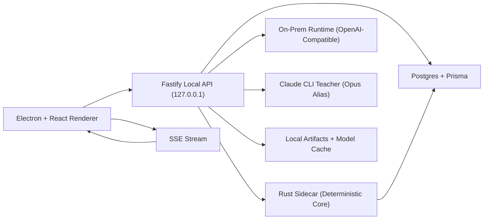
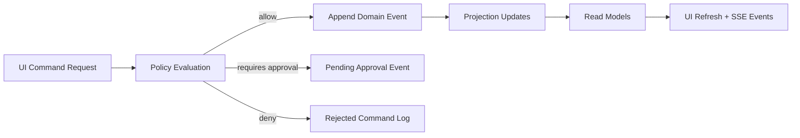
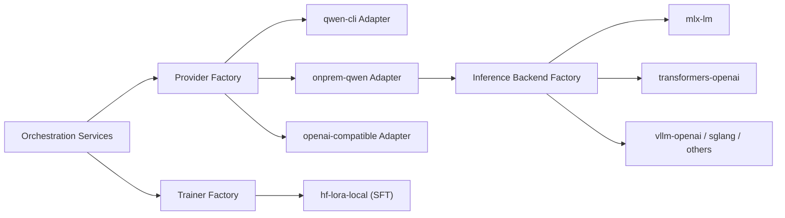
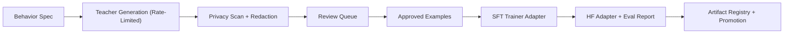
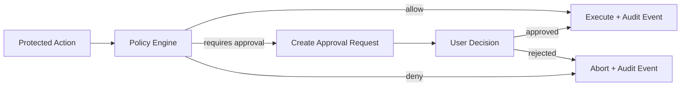

# Architecture

## Runtime Topology

```mermaid
flowchart LR
  UI["Electron + React Renderer"] --> BFF["Fastify Local API (127.0.0.1)"]
  UI --> SSE["SSE Stream"]
  SSE --> UI
  BFF --> Sidecar["Rust Sidecar (Deterministic Core)"]
  BFF --> DB["Postgres + Prisma"]
  Sidecar --> DB
  BFF --> Runtime["On-Prem Runtime (OpenAI-Compatible)"]
  BFF --> Teacher["Claude CLI Teacher (Opus Alias)"]
  BFF --> FS["Local Artifacts + Model Cache"]
```

## Command/Event Write Path

```mermaid
flowchart LR
  Cmd["UI Command Request"] --> Policy["Policy Evaluation"]
  Policy -->|"allow"| Append["Append Domain Event"]
  Policy -->|"requires approval"| Approval["Pending Approval Event"]
  Policy -->|"deny"| Reject["Rejected Command Log"]
  Append --> Proj["Projection Updates"]
  Proj --> Query["Read Models"]
  Query --> UIRead["UI Refresh + SSE Events"]
```

## Factory Layering

```mermaid
flowchart LR
  App["Orchestration Services"] --> ProviderFactory["Provider Factory"]
  App --> TrainerFactory["Trainer Factory"]
  ProviderFactory --> P1["qwen-cli Adapter"]
  ProviderFactory --> P2["onprem-qwen Adapter"]
  ProviderFactory --> P3["openai-compatible Adapter"]
  P2 --> BackendFactory["Inference Backend Factory"]
  BackendFactory --> B1["mlx-lm"]
  BackendFactory --> B2["transformers-openai"]
  BackendFactory --> B3["vllm-openai / sglang / others"]
  TrainerFactory --> T1["hf-lora-local (SFT)"]
```

## Distillation Pipeline

```mermaid
flowchart LR
  Spec["Behavior Spec"] --> TeacherJob["Teacher Generation (Rate-Limited)"]
  TeacherJob --> Privacy["Privacy Scan + Redaction"]
  Privacy --> Review["Review Queue"]
  Review --> Approved["Approved Examples"]
  Approved --> Train["SFT Trainer Adapter"]
  Train --> Artifacts["HF Adapter + Eval Report"]
  Artifacts --> Registry["Artifact Registry + Promotion"]
```

## Policy Decision Flow

```mermaid
flowchart LR
  Action["Protected Action"] --> Eval["Policy Engine"]
  Eval -->|"allow"| Execute["Execute + Audit Event"]
  Eval -->|"requires approval"| Hold["Create Approval Request"]
  Hold --> Decide["User Decision"]
  Decide -->|"approved"| Execute
  Decide -->|"rejected"| Stop["Abort + Audit Event"]
  Eval -->|"deny"| Stop
```
