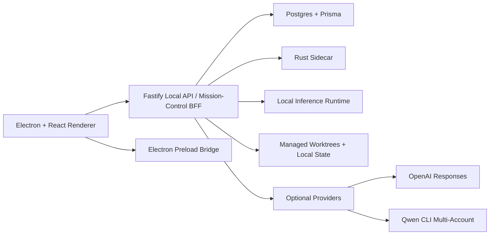
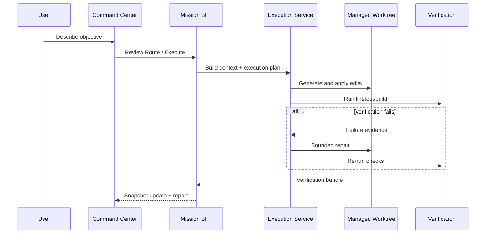

# Architecture

## Product Shape

The product is now a desktop-first command center for coding work.

The normal operator flow is:
1. connect or create a project
2. confirm the project blueprint
3. issue an objective in `Live State`
4. review the route
5. execute in a managed worktree
6. verify with real lint/test/build commands
7. inspect code, logs, approvals, comments, and the final report

The normal product surface is:
- `Live State`
- `Codebase`
- `Console`
- `Projects`
- `Settings`

Labs and internal tooling still exist, but they are intentionally pushed out of the first-layer UX.

## Runtime Topology



## Core Product Objects

### Project
A connected repo is represented as a project binding plus a managed worktree.

The product operates on the managed worktree by default so the original repo stays protected.

### Project Blueprint
Every project gets a `ProjectBlueprint` that acts as the operating contract for:
- coding standards
- testing policy
- documentation policy
- execution policy
- provider policy

Blueprints are extracted from repo files first and can then be refined in-app.

### Workflow
The main command-center board shows workflows in four canonical lanes:
- `Backlog`
- `In Progress`
- `Needs Review`
- `Completed`

`Blocked` is not its own lane. It is a workflow state that surfaces within the current lane.

### Execution Attempt
An execution attempt is the concrete coding run:
- route chosen
- files targeted
- edits applied
- verification commands run
- repair rounds used
- outcome recorded

### Verification Bundle
Each successful or failed run produces a verification bundle describing:
- commands run
- passing checks
- failures
- repair actions
- evidence artifacts

## Frontend Composition

### Live State
`Live State` is the command center.

It contains:
1. `Overseer Command` hero card
2. workflow summary row
3. four-lane kanban board
4. right-side detail drawer

The board is hierarchical:
- top level: lane summaries
- second level: inline card expansion
- third level: drawer detail for workflow/task/run/approval context

### Codebase
`Codebase` reads real files from the active managed worktree.

It defaults to impacted/context-pack files when a workflow is selected, and can expand to the full tree.

### Console
`Console` shows only real events:
- execution
- verification
- provider
- approval
- indexing

No synthetic ambient logs are generated in the product path.

## Backend Layers

### Mission-Control BFF
The Fastify layer is not just a thin API wrapper anymore. It acts as the mission-control aggregation layer for the command center:
- project state
- workflow cards
- drawer detail
- approvals
- codebase scope
- console scope
- blueprint summary
- route summary

This is what keeps the frontend from having to stitch together many separate endpoints for every visible screen.

### Repo and Worktree Layer
`RepoService` is responsible for:
- connecting local repos
- bootstrapping empty folders into new projects
- cloning or attaching supported repo types
- maintaining managed worktrees
- reading codebase trees and file content safely

### Execution Layer
`ExecutionService` is the coding loop.

It follows a bounded pattern:
1. `Fast` shapes context and target scope
2. `Build` plans file edits and generates code
3. verification runs against the worktree
4. bounded repair loops attempt correction
5. a report is generated

The current design intentionally prefers a strict staged workflow over a vague free-form coding chat.

### Verification Layer
Verification is real and command-driven:
- lint
- tests
- build

Verification selection is blueprint-aware.

### Ticket / Workflow Layer
`TicketService` and mission aggregation shape workflow data for the board:
- lane state
- blocked state
- review-ready state
- ordering
- comments / activity notes
- detail drawer content

Drag and drop is not cosmetic. It performs real backend workflow moves.

## Model and Provider Strategy

### User-facing modes
The UI uses simple labels:
- `Fast`
- `Build`
- `Review`
- `Escalate`

### Current provider mapping
- `Fast` -> local `Qwen/Qwen3.5-0.8B`
- `Build` -> local `mlx-community/Qwen3.5-4B-4bit`
- `Review` -> local `mlx-community/Qwen3.5-4B-4bit` with deeper reasoning
- `Escalate` -> `openai-responses`

Optional provider path:
- `qwen-cli` remains available as a provider-level alternative with multi-account failover

### Principle
The product should expose the role semantics, not the provider internals, unless the operator opens advanced/runtime settings.

## Execution Pipeline



## Current Architectural Decisions

### What is intentionally true now
- desktop app is the primary product path
- browser preview is secondary and explicitly limited
- command center is the main operator surface
- the four-lane board is the workflow truth in the UI
- comments are real authored notes with threading
- codebase and console are real, not mocked
- drag/drop changes real backend state

### What is intentionally deferred
- broad mutating multi-agent execution
- richer threaded collaboration features beyond the current note/reply model
- full remote GitHub App installation UX polish
- exposing internal benchmark/distillation flows in the first-layer product

## Generated Local State

The following directories are generated and safe to clean when needed:

```text
.local/repos/
.local/benchmark-runs/
output/playwright/
dist/
dist-server/
dist-sidecar/
```

The source of truth remains:
- `src/`
- `prisma/`
- `scripts/`
- `rust/`
- `docs/`

