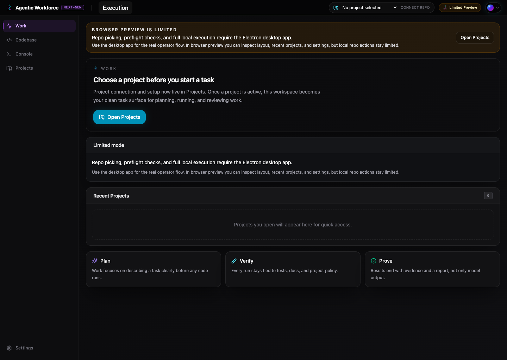
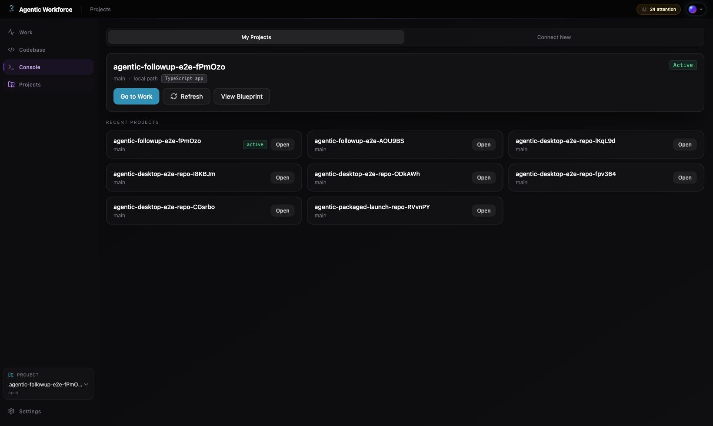
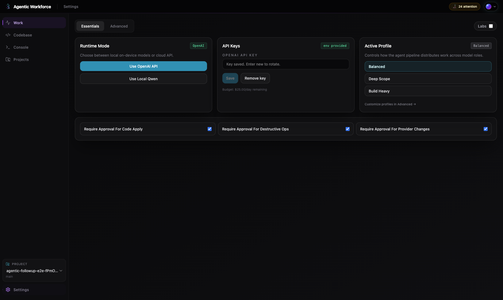

# Onboarding (First 30 Minutes)

## Goal

Get one real success signal fast:
- launch the desktop app
- connect or create a repo
- run one bounded change
- inspect the result in `Work`, `Codebase`, and `Console`

The product is now centered on the command-center flow, not a separate backlog/admin flow.

If you are still choosing a runtime or install path, read [docs/configuration.md](configuration.md) and [docs/known-limitations.md](known-limitations.md) first.

## 0-5 min: Boot the Product

From the repository root:

```bash
npm install
cp .env.example .env
npm run db:up
npx prisma db push
npx prisma generate
npm run dev:desktop
```

Expected:
- Electron window opens
- local API is reachable on `127.0.0.1:8787`
- `Work` loads as the primary task surface

## 5-10 min: Configure The Recommended Runtime

The recommended first-success path is OpenAI-assisted.

1. Add `OPENAI_API_KEY` to your local `.env`.
2. Open `Settings`.
3. Stay in `Essentials` and switch runtime mode to `OpenAI API`.
4. If you want the default recommended mapping, open `Advanced` and use `Apply recommended OpenAI roles`.

Current tested role setup:
- `Fast` -> `gpt-5-nano`
- `Build` -> `gpt-5.3-codex`
- `Review` -> `gpt-5.4`
- `Escalate` -> `gpt-5.4`

If you want a fully local runtime path instead, use the advanced local-runtime guide: [docs/runbooks/local-runtime.md](runbooks/local-runtime.md)

## 10-15 min: Create or Connect a Project

### Fastest path: New project
1. Open `Projects`
2. Click `New Project`
3. Choose `Blank Project`
4. Pick an empty folder
5. Let the app initialize Git, create the managed worktree, and activate the repo
6. If you want structure immediately, click `Apply Starter` and choose `Neutral Baseline` or `TypeScript App`

### Existing repo path
1. Open `Projects`
2. Click `Choose Local Repo`
3. Pick a local Git repo
4. Let the app build the blueprint and code graph

Expected:
- project appears in the header switcher
- `Projects` shows the active project and blueprint summary
- `Work` is now ready for a task

## 15-20 min: Use the Command Center

Return to `Work`.

The screen is organized into:
- top `Describe the task` composer
- `Review the Plan` route panel
- four-lane workflow board
- final outcome/evidence summary when a run completes
- optional right-side detail drawer on desktop

Lanes:
- `Backlog`
- `In Progress`
- `Needs Review`
- `Completed`

What to try:
1. Type a bounded objective in the command card
2. Click `Review plan`
3. Click `Run task`
4. Watch the workflow card move through the board
5. Click a card to expand it inline
6. Open the task detail drawer for logs, approvals, authored notes, and verification

Reference screenshots:





## 20-25 min: Inspect Real Outputs

### Codebase
1. Open `Codebase`
2. Confirm you can browse real files from the managed worktree
3. Open the generated or modified source file

### Console
1. Open `Console`
2. Confirm you see real:
   - execution events
   - verification events
   - provider events
   - approvals
   - indexing events

The console is no longer synthetic. If it is empty, it means nothing happened yet.

## 25-30 min: Run a Proven Task

Recommended first tasks:

1. `Create the initial README and repo charter for this project`
2. `Add a status badge component and test it. Update docs if needed.`
3. `Change the hero headline and update the test`

The current flow is strongest on bounded, explicit changes with clear verification.

## What is Real Today

- Desktop app flow
- Local repo connect
- New project bootstrap from an empty folder
- Project blueprint generation
- Four-lane kanban command board
- Drag/drop lane transitions
- Inline workflow expansion
- Right-side task detail drawer
- Threaded authored notes/comments
- Real Codebase view
- Real Console view
- Local verification with lint/test/build

## What Is Still Advanced or Secondary

- Browser preview is secondary and cannot use the native folder picker
- OpenAI escalation is optional
- Qwen CLI multi-account failover is optional
- Benchmarks and other specialized tooling live behind `Settings > Advanced` with Labs enabled

If any of those advanced paths are what you need, use the deeper guides instead of treating the first-run flow as broken:

- [docs/runbooks/local-runtime.md](runbooks/local-runtime.md)
- [docs/testing.md](testing.md)
- [docs/demo.md](demo.md)

## Daily Operator Checklist

- launch with `npm run start:desktop`
- confirm local runtime health
- confirm the active project in the header
- use `Work` for task entry, route review, and workflow status
- use `Codebase` and `Console` to inspect evidence
- use the drawer for threaded notes, approvals, and verification detail
