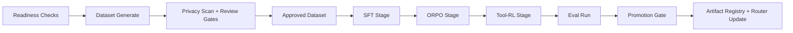

# Runbook: Distillation Full Pass (SFT + ORPO + Tool-RL)

## Preconditions

- API running (`npm run dev:api` or desktop app started).
- `claude auth status` is logged in.
- Local inference runtime reachable on `127.0.0.1:8000` (recommended).
- Python trainer deps installed (`torch`, `transformers`, `datasets`, `peft`, `accelerate`).

## One-Command Readiness Check

Install trainer dependencies once:

```bash
python3 -m pip install --upgrade -r scripts/distill/requirements.txt
```

```bash
npm run distill:doctor -- --strict
```

If API is live, this uses `/api/v2/distill/readiness`; otherwise it falls back to local checks.

## Recommended Env Defaults

```bash
export DISTILL_FULL_PASS_SAMPLE_COUNT=30
export DISTILL_FULL_PASS_RETRIEVAL_IDS="knowledge-001,knowledge-002"
export DISTILL_FULL_PASS_MODELS="Qwen/Qwen3.5-0.8B,Qwen/Qwen3.5-4B"
export DISTILL_FULL_PASS_STAGES="sft,orpo,tool_rl"
export DISTILL_FULL_PASS_MIN_APPROVED_RATIO=0.6
```

## Full Pass Command

```bash
npm run distill:run:full
```

Preparation-only mode (dataset + approvals only):

```bash
npm run distill:run:full -- --prepare-only
```

For smoke tests with tiny batches, temporarily relax the gate:

```bash
DISTILL_FULL_PASS_MIN_APPROVED_RATIO=0 npm run distill:run:full -- --prepare-only
```

## Pipeline



## Stage Notes

- `sft`: behavior-spec imitation and tool-schema alignment.
- `orpo`: preference optimization against degraded alternatives.
- `tool_rl`: reward-weighted optimization for tool discipline and safety checks.

## Failure Signatures

- `trainer_unavailable`: missing Python deps or trainer command issues.
- `dataset_insufficient`: not enough approved examples.
- `rate_limited` / `budget_exhausted`: teacher throttle or daily token cap.
- `unknown`: inspect run logs (`GET /api/v2/distill/runs/:id/logs`).

## Recovery

1. Fix blockers from `npm run distill:doctor -- --strict`.
2. Regenerate dataset with lower sample count if teacher quota is tight.
3. Re-run only failed stage from Distill Lab (`stage` + `dataset_id`).
4. Re-run eval before promotion.
