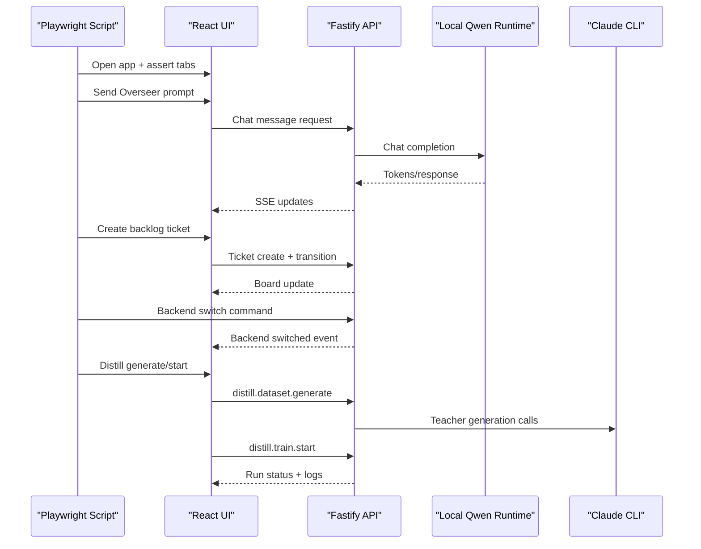

# Runbook: Playwright E2E (Critical + Failover)

## Command

```bash
npm run test:e2e:playwright
```

Artifacts output:
- `output/playwright/e2e-critical-<timestamp>/`

Contains:
- step snapshots (`*.yml`)
- step screenshots (`*.png`)
- `console.log`
- `network.log`
- `summary.json`

## Flow Covered

1. Open app and verify navigation sections.
2. Configure on-prem runtime model.
3. Send Overseer chat and validate response.
4. Create backlog ticket and transition it.
5. Switch inference backend and switch back.
6. Run Distill Lab generate -> review -> training kickoff.

## E2E Sequence



## If E2E Fails

1. Inspect `summary.json` and `console.log` first.
2. Open the failing step screenshot.
3. Re-run with a clean dev stack (`dev:api`, `dev`) and no stale sessions.
4. Verify `127.0.0.1:8000` runtime health and `claude auth status`.
