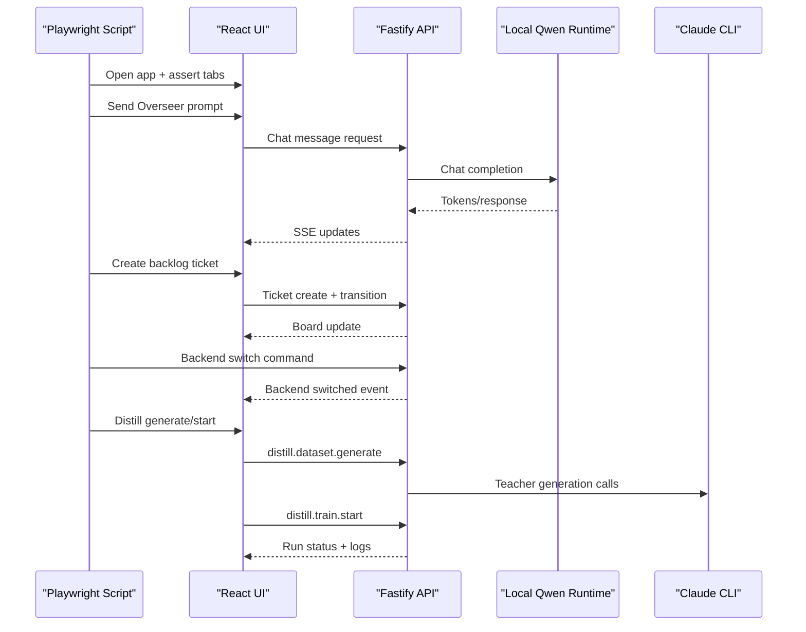

# Runbook: Playwright E2E (Stable, Nightly, and Media)

## Primary Commands

```bash
npm run test:e2e:desktop-stable
npm run test:e2e:nightly
npm run test:e2e:desktop-packaged-smoke
npm run demo:capture
npm run demo:render
```

Artifacts output:
- `output/playwright/desktop-stable-<timestamp>/`
- `output/playwright/nightly-suite-<timestamp>/`
- `output/playwright/packaged-desktop-smoke-<timestamp>/`
- `output/playwright/demo-render-<timestamp>/`

Contains:
- step snapshots (`*.yml`)
- step screenshots (`*.png`)
- `console.log`
- `network.log`
- `summary.json`

## Stable Desktop Tier

`npm run test:e2e:desktop-stable`

Purpose:
- create a blank project from an empty folder
- apply a starter from the Projects flow
- attach an existing deterministic repo fixture
- run one bounded follow-up task
- verify `Work`, `Codebase`, and `Console` against real managed-worktree output

Recommended runtime presets:

```bash
# OpenAI-backed stable acceptance
OPENAI_API_KEY=... E2E_RUNTIME_PRESET=openai_all npm run test:e2e:desktop-stable

# Local runtime-backed acceptance
E2E_RUNTIME_PRESET=default npm run test:e2e:desktop-stable
```

## Nightly / Manual Tier

`npm run test:e2e:nightly`

Purpose:
- CLI companion smoke
- follow-up execution scenarios
- optional browser-preview failover coverage when `ENABLE_LOCAL_FAILOVER_E2E=1`

The nightly suite intentionally skips OpenAI-backed follow-up scenarios when `OPENAI_API_KEY` is not configured.

## Demo Media

Use the stable desktop acceptance harness as the source of truth for README/demo captures:

```bash
npm run demo:capture
npm run demo:render
```

`demo:render` writes the README GIF into `docs/media/` and keeps larger video artifacts under `output/playwright/`.

## Legacy Critical Failover Flow

The older browser-preview critical failover script still exists and remains useful when you have the full local stack available:

```bash
npm run test:e2e:playwright
```

It covers:

1. Open app and verify navigation sections.
2. Configure on-prem runtime model.
3. Send Overseer chat and validate response.
4. Create backlog ticket and transition it.
5. Switch inference backend and switch back.
6. Run Distill Lab generate -> review -> training kickoff.

## E2E Sequence



## If E2E Fails

1. Inspect `summary.json` and `console.log` first.
2. Open the failing step screenshot.
3. Re-run with a clean dev stack (`dev:api`, `dev`) and no stale sessions.
4. Verify `127.0.0.1:8000` runtime health and `claude auth status`.
