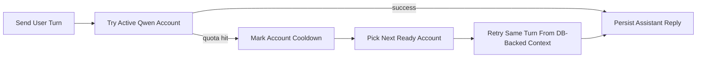

# Runbook: Qwen CLI Accounts

## Goal

Use Google-backed Qwen CLI accounts as a provider-level alternative to local models, with isolated profiles and automatic failover when quota is hit.

## What This Mode Does

- keeps each account in its own isolated profile home
- lets you add multiple Google-backed Qwen accounts inside the app
- retries the same turn on the next ready account after a quota-hit is detected
- preserves the coding turn because the canonical conversation state is stored in the app database

## Add an Account

1. Open `Settings`.
2. Select provider `Qwen CLI`.
3. Click `Create + Auth`.
4. Complete the Qwen login flow for that Google-backed account.
5. Click `Verify Auth`.
6. Confirm the account state becomes `ready`.

Repeat for each account you want available for failover.

## Import an Existing Qwen Login

If you already have a working `~/.qwen` login:

1. Open `Settings`.
2. Select provider `Qwen CLI`.
3. Click `Import Current`.
4. Verify the imported account becomes `ready`.

## How Failover Works

## Why Session Continuity Holds

- the user message is stored before provider execution starts
- account retries use canonical DB-backed history, not terminal-only context
- output from a failed account attempt is buffered and not committed as the live assistant reply
- the app emits account switch events and retries on the next ready profile

This is designed to mirror the manual workflow that already works when you re-auth another account and continue, but without requiring that handoff in a separate terminal.

## Operational Notes

- use `enabled` only for accounts you want in the active failover pool
- use `Verify Auth` after login changes
- if an account breaks, mark it disabled or re-auth it
- the provider currently acts as a provider-level alternative, not a mixed fallback under the local model router

## Recommended Test

1. Configure at least two accounts.
2. Switch the active provider to `Qwen CLI`.
3. Send a normal Overseer message and confirm a reply.
4. Force or wait for a real quota-hit on the first account.
5. Confirm the next turn completes on another ready account without losing the session flow.

## Known Limitation

The app can only prove real multi-account failover if at least two distinct authenticated accounts are configured. With one account, the provider path works, but full live quota rotation is not yet proven in practice.
